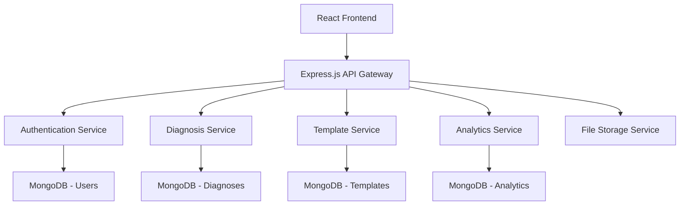

# 設計文書

## 概要

教員ナビゲーター診断SaaSは、モダンなJavaScript技術スタックを使用したフルスタックWebアプリケーションです。マイクロサービス的なアーキテクチャを採用し、スケーラブルで保守性の高いシステムを構築します。

## アーキテクチャ

### システム全体構成



### 技術スタック詳細

- **フロントエンド**: React 18 + React Router + Axios + Material-UI
- **バックエンド**: Node.js 18 + Express.js + Mongoose ODM
- **データベース**: MongoDB Atlas (クラウド)
- **認証**: JWT + bcrypt
- **ファイル生成**: PDFKit (サーバーサイド) + jsPDF (クライアントサイド)
- **デプロイ**: Docker + AWS/Vercel

## コンポーネントとインターフェース

### フロントエンドコンポーネント構成

```
src/
├── components/
│   ├── common/
│   │   ├── Header.jsx
│   │   ├── Footer.jsx
│   │   └── LoadingSpinner.jsx
│   ├── auth/
│   │   ├── LoginForm.jsx
│   │   ├── RegisterForm.jsx
│   │   └── PasswordReset.jsx
│   ├── diagnosis/
│   │   ├── DiagnosisWizard.jsx
│   │   ├── QuestionCard.jsx
│   │   └── ResultDisplay.jsx
│   ├── teaching-style/
│   │   ├── StyleRecommendations.jsx
│   │   ├── StyleCard.jsx
│   │   └── StyleDetails.jsx
│   ├── templates/
│   │   ├── TemplateGenerator.jsx
│   │   ├── TemplateEditor.jsx
│   │   └── TemplateLibrary.jsx
│   └── analytics/
│       ├── Dashboard.jsx
│       ├── ProgressChart.jsx
│       └── ReportViewer.jsx
├── pages/
│   ├── HomePage.jsx
│   ├── DiagnosisPage.jsx
│   ├── ResultsPage.jsx
│   ├── TemplatesPage.jsx
│   └── DashboardPage.jsx
├── services/
│   ├── api.js
│   ├── auth.js
│   └── storage.js
└── utils/
    ├── constants.js
    └── helpers.js
```

### バックエンドAPI構成

```
server/
├── routes/
│   ├── auth.js          // POST /api/auth/login, /register
│   ├── diagnosis.js     // GET/POST /api/diagnosis
│   ├── teaching-style.js // GET /api/teaching-styles
│   ├── templates.js     // GET/POST /api/templates
│   └── analytics.js     // GET /api/analytics
├── models/
│   ├── User.js
│   ├── Diagnosis.js
│   ├── TeachingStyle.js
│   ├── Template.js
│   └── Analytics.js
├── services/
│   ├── diagnosisEngine.js
│   ├── styleRecommender.js
│   ├── templateGenerator.js
│   └── pdfGenerator.js
├── middleware/
│   ├── auth.js
│   ├── validation.js
│   └── errorHandler.js
└── utils/
    ├── database.js
    └── constants.js
```

### API エンドポイント設計

#### 認証関連
- `POST /api/auth/register` - ユーザー登録
- `POST /api/auth/login` - ログイン
- `POST /api/auth/logout` - ログアウト
- `POST /api/auth/reset-password` - パスワードリセット

#### 診断関連
- `GET /api/diagnosis/questions` - 診断質問取得
- `POST /api/diagnosis/submit` - 診断結果送信
- `GET /api/diagnosis/results/:id` - 診断結果取得
- `GET /api/diagnosis/history` - 診断履歴取得

#### 授業スタイル関連
- `GET /api/teaching-styles/recommendations/:diagnosisId` - スタイル推奨
- `GET /api/teaching-styles/:id` - 特定スタイル詳細
- `POST /api/teaching-styles/feedback` - フィードバック送信

#### テンプレート関連
- `POST /api/templates/generate` - テンプレート生成
- `GET /api/templates/library` - テンプレートライブラリ
- `PUT /api/templates/:id` - テンプレート編集
- `GET /api/templates/:id/download` - PDF ダウンロード

#### 分析関連
- `GET /api/analytics/dashboard` - ダッシュボードデータ
- `GET /api/analytics/progress` - 進捗データ
- `GET /api/analytics/reports` - レポート生成

## データモデル

### User モデル
```javascript
{
  _id: ObjectId,
  email: String (unique),
  password: String (hashed),
  profile: {
    name: String,
    school: String,
    subjects: [String],
    experience: Number
  },
  createdAt: Date,
  updatedAt: Date
}
```

### Diagnosis モデル
```javascript
{
  _id: ObjectId,
  userId: ObjectId,
  questions: [{
    questionId: String,
    answer: Number,
    timestamp: Date
  }],
  result: {
    personalityType: String,
    scores: {
      extroversion: Number,
      sensing: Number,
      thinking: Number,
      judging: Number
    },
    strengths: [String],
    challenges: [String]
  },
  completedAt: Date,
  createdAt: Date
}
```

### TeachingStyle モデル
```javascript
{
  _id: ObjectId,
  name: String,
  description: String,
  personalityTypes: [String],
  characteristics: [String],
  methods: [String],
  subjects: [String],
  examples: [String],
  resources: [String]
}
```

### Template モデル
```javascript
{
  _id: ObjectId,
  userId: ObjectId,
  teachingStyleId: ObjectId,
  title: String,
  subject: String,
  gradeLevel: String,
  content: {
    lessonPlan: String,
    objectives: [String],
    activities: [String],
    materials: [String],
    assessment: String
  },
  customizations: Object,
  createdAt: Date,
  updatedAt: Date
}
```

## エラーハンドリング

### エラー分類と対応

1. **認証エラー (401)**
   - 無効なトークン
   - セッション期限切れ
   - 対応: 自動ログアウト + ログイン画面へリダイレクト

2. **認可エラー (403)**
   - 権限不足
   - 対応: エラーメッセージ表示

3. **バリデーションエラー (400)**
   - 入力値不正
   - 必須項目未入力
   - 対応: フィールド別エラーメッセージ表示

4. **サーバーエラー (500)**
   - データベース接続エラー
   - 外部API呼び出しエラー
   - 対応: 汎用エラーメッセージ + ログ記録

### エラーハンドリング実装

```javascript
// Express.js エラーミドルウェア
const errorHandler = (err, req, res, next) => {
  const { statusCode = 500, message } = err;
  
  res.status(statusCode).json({
    success: false,
    error: {
      message,
      ...(process.env.NODE_ENV === 'development' && { stack: err.stack })
    }
  });
};

// React エラーバウンダリ
class ErrorBoundary extends React.Component {
  constructor(props) {
    super(props);
    this.state = { hasError: false };
  }
  
  static getDerivedStateFromError(error) {
    return { hasError: true };
  }
  
  render() {
    if (this.state.hasError) {
      return <ErrorFallback />;
    }
    return this.props.children;
  }
}
```

## テスト戦略

### テスト構成

1. **ユニットテスト**
   - フロントエンド: Jest + React Testing Library
   - バックエンド: Jest + Supertest
   - カバレッジ目標: 80%以上

2. **統合テスト**
   - API エンドポイントテスト
   - データベース操作テスト
   - 認証フローテスト

3. **E2Eテスト**
   - Cypress を使用
   - 主要ユーザーフロー
   - クロスブラウザテスト

### テスト実装例

```javascript
// バックエンド API テスト
describe('POST /api/diagnosis/submit', () => {
  it('should create diagnosis with valid data', async () => {
    const response = await request(app)
      .post('/api/diagnosis/submit')
      .set('Authorization', `Bearer ${token}`)
      .send(validDiagnosisData)
      .expect(201);
    
    expect(response.body.success).toBe(true);
    expect(response.body.data.result).toBeDefined();
  });
});

// フロントエンド コンポーネントテスト
describe('DiagnosisWizard', () => {
  it('should render questions and handle answers', () => {
    render(<DiagnosisWizard questions={mockQuestions} />);
    
    expect(screen.getByText('質問 1')).toBeInTheDocument();
    
    fireEvent.click(screen.getByText('次へ'));
    expect(screen.getByText('質問 2')).toBeInTheDocument();
  });
});
```

### パフォーマンス最適化

1. **フロントエンド最適化**
   - React.memo でコンポーネント最適化
   - useMemo/useCallback でレンダリング最適化
   - Code splitting で初期ロード時間短縮
   - 画像最適化 (WebP形式)

2. **バックエンド最適化**
   - MongoDB インデックス設定
   - レスポンスキャッシュ (Redis)
   - API レスポンス圧縮
   - 非同期処理でブロッキング回避

3. **データベース最適化**
   - 適切なインデックス設計
   - クエリ最適化
   - 接続プール設定
   - データ正規化

### セキュリティ対策

1. **認証・認可**
   - JWT トークンの適切な管理
   - パスワードハッシュ化 (bcrypt)
   - セッション管理

2. **データ保護**
   - 入力値サニタイゼーション
   - SQLインジェクション対策
   - XSS対策
   - CSRF対策

3. **通信セキュリティ**
   - HTTPS強制
   - CORS設定
   - レート制限
   - セキュリティヘッダー設定